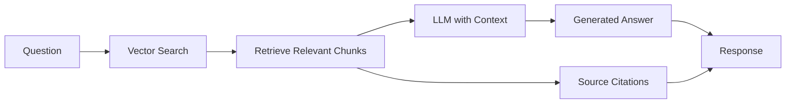

# Conference Call MCP Tools

Complete reference for all conference call analysis tools available in Claude Desktop.

## Tool Overview

| Tool Name | Purpose | API Keys Required |
|-----------|---------|------------------|
| `concall_fetch_transcript` | Fetch earnings call transcripts | None |
| `concall_summarize_transcript` | Generate AI-powered summaries | OPENROUTER_API_KEY |
| `concall_analyze_sentiment` | Analyze sentiment and tone | OPENROUTER_API_KEY |
| `concall_query_transcript` | Ask questions using RAG | OPENROUTER_API_KEY, OPENAI_API_KEY |
| `concall_compare_quarters` | Compare sentiment trends | OPENROUTER_API_KEY |

## Tool Details

### 1. concall_fetch_transcript

Fetch earnings call transcripts from multiple sources with automatic fallback.

#### Parameters

| Parameter | Type | Required | Default | Description |
|-----------|------|----------|---------|-------------|
| `ticker` | string | Yes | - | Stock symbol (e.g., "RELIANCE.NS", "TCS.NS") |
| `quarter` | string | Yes | - | Quarter ("Q1", "Q2", "Q3", "Q4") |
| `fiscal_year` | int | Yes | - | Fiscal year (e.g., 2025) |
| `save_to_db` | bool | No | True | Save transcript to database |

#### Returns

```python
{
    "ticker": "RELIANCE.NS",
    "quarter": "Q1",
    "fiscal_year": 2025,
    "transcript_text": "Full transcript content...",
    "source": "IR_WEBSITE",  # or "NSE"
    "fetch_date": "2025-01-15T10:30:00Z",
    "word_count": 8543,
    "transcript_url": "https://...",
    "call_date": "2025-01-12"
}
```

#### Examples

```
Fetch the RELIANCE.NS Q1 2025 earnings call transcript
```

```
Get transcript for TCS Q4 2024 and save it to the database
```

#### Error Handling

```python
{
    "error": "No transcript found",
    "ticker": "INVALID.NS",
    "quarter": "Q1",
    "fiscal_year": 2025,
    "message": "Failed to fetch transcript. Check if IR mapping exists in database."
}
```

---

### 2. concall_summarize_transcript

Generate comprehensive AI-powered summaries of earnings call transcripts.

#### Parameters

| Parameter | Type | Required | Default | Description |
|-----------|------|----------|---------|-------------|
| `ticker` | string | Yes | - | Stock symbol |
| `quarter` | string | Yes | - | Quarter |
| `fiscal_year` | int | Yes | - | Fiscal year |
| `mode` | string | No | "standard" | Detail level: "concise", "standard", "detailed" |
| `force_refresh` | bool | No | False | Regenerate even if cached |

#### Summary Modes

| Mode | Max Tokens | Use Case | Cost |
|------|------------|----------|------|
| `concise` | 1500 | Quick overview | ~$0.01 |
| `standard` | 3000 | Balanced detail | ~$0.02-0.03 |
| `detailed` | 5000 | Deep analysis | ~$0.04-0.05 |

#### Returns

```python
{
    "executive_summary": "Strong quarter with 15% YoY revenue growth...",
    "key_metrics": {
        "revenue": "$10.5B",
        "revenue_growth": "15% YoY",
        "net_profit": "$2.1B",
        "profit_margin": "20%",
        "eps": "$1.25",
        "guidance": "15-18% growth expected for next quarter"
    },
    "business_highlights": [
        "Jio subscriber base grew to 450M",
        "Retail expansion with 200 new stores",
        "Digital services revenue up 25%"
    ],
    "management_guidance": "Confident in maintaining double-digit growth...",
    "sentiment": "positive",
    "key_risks": [
        "Regulatory challenges in telecom",
        "Rising crude oil prices"
    ],
    "opportunities": [
        "5G rollout acceleration",
        "Digital commerce expansion"
    ],
    "qa_insights": [
        "Analysts focused on capex plans",
        "Questions about debt reduction strategy"
    ],
    "market_context": "Outperforming sector peers...",
    "analyst_focus": ["Growth strategy", "Debt management", "Digital initiatives"]
}
```

#### Examples

```
Summarize the RELIANCE.NS Q1 2025 earnings call in standard detail
```

```
Generate a detailed summary of the TCS Q4 2024 call
```

```
Give me a concise summary of INFY Q1 2025, force refresh even if cached
```

---

### 3. concall_analyze_sentiment

Perform multi-dimensional sentiment analysis on earnings call transcripts.

#### Parameters

| Parameter | Type | Required | Default | Description |
|-----------|------|----------|---------|-------------|
| `ticker` | string | Yes | - | Stock symbol |
| `quarter` | string | Yes | - | Quarter |
| `fiscal_year` | int | Yes | - | Fiscal year |
| `use_cache` | bool | No | True | Use cached results if available |

#### Sentiment Scale

| Score | Label | Meaning |
|-------|-------|---------|
| 5 | very_bullish | Exceptional results, strong guidance, highly confident |
| 4 | bullish | Good results, positive guidance, confident tone |
| 3 | neutral | Mixed results, cautious guidance, balanced tone |
| 2 | bearish | Weak results, lowered guidance, defensive tone |
| 1 | very_bearish | Poor results, no guidance, uncertain management |

#### Returns

```python
{
    "overall_sentiment": "bullish",
    "sentiment_score": 4,
    "confidence_score": 0.85,
    "management_tone": "confident",
    "outlook_sentiment": "positive",
    "risk_sentiment": "low_risk",
    "key_positive_signals": [
        "Strong revenue growth of 15%",
        "Expanded profit margins",
        "Confident guidance for next quarter"
    ],
    "key_negative_signals": [
        "Supply chain challenges mentioned",
        "Competitive pressure in retail"
    ],
    "hedge_words_count": 5,
    "certainty_indicators": [
        "We will deliver",
        "Committed to growth",
        "Confident in our strategy"
    ],
    "sentiment_rationale": "Strong financial performance with confident management outlook",
    "tone_rationale": "Management expressed high confidence with minimal hedging"
}
```

#### Examples

```
Analyze the sentiment of the RELIANCE.NS Q1 2025 earnings call
```

```
What was the management tone in the TCS Q4 2024 call?
```

```
Analyze sentiment for INFY Q1 2025 without using cache
```

---

### 4. concall_query_transcript

Ask questions about earnings call transcripts using RAG (Retrieval-Augmented Generation).

#### Parameters

| Parameter | Type | Required | Default | Description |
|-----------|------|----------|---------|-------------|
| `question` | string | Yes | - | Question to ask about the transcript |
| `ticker` | string | Yes | - | Stock symbol |
| `quarter` | string | Yes | - | Quarter |
| `fiscal_year` | int | Yes | - | Fiscal year |
| `top_k` | int | No | 5 | Number of relevant chunks to retrieve |

#### How RAG Works



#### Returns

```python
{
    "answer": "Revenue grew 15% year-over-year to $10.5B in Q1 2025...",
    "sources": [
        {
            "content": "Revenue for Q1 was $10.5B, representing a 15% increase...",
            "score": 0.85,
            "chunk_index": 5
        },
        {
            "content": "Management expressed confidence in maintaining this growth trajectory...",
            "score": 0.78,
            "chunk_index": 12
        }
    ],
    "metadata": {
        "ticker": "RELIANCE.NS",
        "quarter": "Q1",
        "fiscal_year": 2025,
        "chunks_retrieved": 5
    }
}
```

#### Examples

```
What was the revenue growth in the RELIANCE.NS Q1 2025 call?
```

```
What did management say about future guidance in the TCS Q4 2024 earnings call?
```

```
Tell me about the margin performance discussed in INFY Q1 2025
```

```
What were the main concerns raised by analysts in the RELIANCE Q1 2025 Q&A?
```

#### Features

- **Semantic Search**: Finds relevant content even with different wording
- **Context-Aware**: LLM generates answers based on retrieved context
- **Source Citations**: Shows exact transcript excerpts used
- **Auto-Indexing**: Automatically indexes transcript on first query

---

### 5. concall_compare_quarters

Compare sentiment across multiple quarters to identify trends.

#### Parameters

| Parameter | Type | Required | Default | Description |
|-----------|------|----------|---------|-------------|
| `ticker` | string | Yes | - | Stock symbol |
| `quarters` | list[tuple] | Yes | - | List of (quarter, fiscal_year) tuples |

#### Returns

```python
{
    "ticker": "RELIANCE.NS",
    "quarters_analyzed": 3,
    "sentiment_trend": "improving",  # or "declining", "stable"
    "score_change": 2,  # Change from first to last quarter
    "sentiments": [
        {
            "quarter": "Q2",
            "fiscal_year": 2024,
            "overall_sentiment": "neutral",
            "sentiment_score": 3,
            "confidence_score": 0.80
        },
        {
            "quarter": "Q3",
            "fiscal_year": 2024,
            "overall_sentiment": "bullish",
            "sentiment_score": 4,
            "confidence_score": 0.82
        },
        {
            "quarter": "Q4",
            "fiscal_year": 2024,
            "overall_sentiment": "very_bullish",
            "sentiment_score": 5,
            "confidence_score": 0.88
        }
    ],
    "average_confidence": 0.83
}
```

#### Examples

```
Compare sentiment for RELIANCE.NS across Q2, Q3, and Q4 of 2024
```

```
Show me the sentiment trend for TCS over the last 4 quarters
```

```
Has management confidence improved for INFY from Q4 2024 to Q1 2025?
```

## Usage Patterns

### Complete Analysis Workflow

```
# 1. Fetch transcript
Fetch the RELIANCE.NS Q1 2025 earnings call

# 2. Get comprehensive summary
Summarize RELIANCE.NS Q1 2025 in detailed mode

# 3. Analyze sentiment
Analyze sentiment for RELIANCE.NS Q1 2025

# 4. Deep dive with questions
What did RELIANCE management say about:
- Jio 5G rollout progress
- Retail expansion plans
- New energy initiatives

# 5. Compare with previous quarters
Compare RELIANCE sentiment across Q4 2024, Q1 2025, and Q2 2025
```

### Multi-Company Analysis

```
# Compare multiple companies
For TCS, INFY, and WIPRO Q1 2025:
1. Fetch all transcripts
2. Generate standard summaries
3. Analyze sentiment for each
4. Compare key metrics and sentiment scores
```

### Trend Analysis

```
# Track evolution over time
For RELIANCE across last 6 quarters:
1. Compare sentiment trends
2. Identify inflection points
3. Correlate with stock price movements
4. Highlight key strategic shifts
```

## Best Practices

### 1. Cost Optimization

- **Use Cache**: Don't force refresh unless necessary
- **Choose Right Mode**: Use "concise" for quick checks
- **Batch Queries**: Analyze multiple quarters in one request

### 2. Quality Results

- **Verify Transcripts**: Check fetch succeeded before analyzing
- **Review Sources**: Check RAG source citations for accuracy
- **Compare Trends**: Use compare_quarters for context

### 3. Error Handling

- **Check API Keys**: Ensure OPENROUTER_API_KEY is set
- **Verify Data**: Confirm transcript exists in database
- **Review Logs**: Check server logs for detailed errors

## API Requirements

| Feature | Required API Keys | Cost Estimate |
|---------|------------------|---------------|
| Fetch Transcripts | None | Free |
| Summarization | OPENROUTER_API_KEY | $0.01-0.05 per call |
| Sentiment Analysis | OPENROUTER_API_KEY | $0.005-0.01 per call |
| RAG Q&A (Setup) | OPENAI_API_KEY | $0.0001 per transcript |
| RAG Q&A (Query) | OPENROUTER_API_KEY | $0.005-0.01 per query |

## Limitations

- **Data Availability**: Limited to companies with IR mappings in database
- **Language**: English transcripts only
- **Recency**: Depends on when transcripts are published
- **Cache**: First analysis takes longer due to AI processing

## Related Documentation

- [Overview](overview.md)
- [Fetching Transcripts](fetching-transcripts.md)
- [AI Summarization](summarization.md)
- [Sentiment Analysis](sentiment-analysis.md)
- [RAG Q&A](rag-qa.md)
