# Conference Call Analysis - Overview

Maverick MCP includes a comprehensive system for analyzing earnings call transcripts using AI-powered tools.

## What is Conference Call Analysis?

Earnings call transcripts contain valuable insights about company performance, management sentiment, and forward guidance. Maverick MCP provides tools to:

- **Fetch** transcripts from multiple sources
- **Summarize** calls with AI-generated structured summaries
- **Analyze** sentiment and management tone
- **Query** transcripts with RAG-powered Q&A
- **Compare** sentiment trends across quarters

## System Architecture


## Key Components

### 1. Transcript Fetching
Multi-source fetching with cascading fallback:

- **Primary**: Company Investor Relations websites
- **Fallback 1**: NSE exchange filings (for Indian stocks)
- **Fallback 2**: [Screener.in](https://www.screener.in/concalls/) (consolidated Indian transcripts)
- **Formats**: PDF, HTML, TXT with automatic parsing

[Learn more →](fetching-transcripts.md)

### 2. AI Summarization
Structured summaries with key information:

- Executive summary
- Financial metrics (revenue, profit, margins, growth)
- Business highlights
- Management guidance
- Sentiment assessment
- Risk factors and opportunities
- Q&A insights

[Learn more →](summarization.md)

### 3. Sentiment Analysis
Multi-dimensional sentiment scoring:

- **Overall Sentiment**: 5-point scale (very_bullish to very_bearish)
- **Management Tone**: confident, cautious, defensive, etc.
- **Outlook Sentiment**: positive, neutral, negative
- **Risk Assessment**: low, moderate, high risk
- **Key Signals**: Positive/negative phrases detected
- **Confidence Score**: Reliability of analysis (0.0-1.0)

[Learn more →](sentiment-analysis.md)

### 4. RAG-Powered Q&A
Ask questions about earnings calls:

- Semantic search using vector embeddings
- Context-aware LLM responses
- Source citations from transcript
- Automatic indexing on first query

[Learn more →](rag-qa.md)

### 5. Comparative Analysis
Track trends over time:

- Compare sentiment across quarters
- Identify improving/declining patterns
- Score changes and confidence trends

## MCP Tools

Five tools available in Claude Desktop:

| Tool | Purpose | Example |
|------|---------|---------|
| `concall_fetch_transcript` | Fetch earnings call transcript | "Fetch RELIANCE.NS Q1 2025" |
| `concall_summarize_transcript` | Generate AI summary | "Summarize TCS Q4 2024 call" |
| `concall_analyze_sentiment` | Analyze sentiment | "Analyze sentiment for INFY Q1 2025" |
| `concall_query_transcript` | Ask questions (RAG) | "What did they say about margins?" |
| `concall_compare_quarters` | Compare over time | "Compare TCS sentiment Q3-Q1" |

[See all tools →](mcp-tools.md)

## Supported Companies

### Pre-configured Indian Companies
- Reliance Industries (RELIANCE.NS)
- TCS (TCS.NS)
- Infosys (INFY.NS)
- Wipro (WIPRO.NS)
- HDFC Bank (HDFCBANK.NS)
- ICICI Bank (ICICIBANK.NS)
- And more...

### Adding New Companies
Use the seeding script to add any company:

```bash
# Edit data/concall_ir_mappings.json
{
  "companies": [
    {
      "ticker": "COMPANY.NS",
      "company_name": "Company Name",
      "ir_base_url": "https://company.com/investors",
      "market": "NSE",
      "country": "IN"
    }
  ]
}

# Seed to database
python scripts/seed_concall_mappings.py --file data/concall_ir_mappings.json
```

## Data Flow

### Fetching & Storage

```mermaid
sequenceDiagram
    participant User
    participant MCP as MCP Tool
    participant Fetcher
    participant Provider as IR/NSE Provider
    participant DB as Database

    User->>MCP: fetch_transcript("RELIANCE.NS", "Q1", 2025)
    MCP->>Fetcher: Fetch request
    Fetcher->>DB: Check cache
    alt Cache Hit
        DB-->>Fetcher: Return cached transcript
    else Cache Miss
        Fetcher->>Provider: Try IR website
        alt IR Success
            Provider-->>Fetcher: PDF/HTML transcript
        else IR Failed
            Provider-->>Fetcher: Try NSE filings
            alt NSE Success
                Provider-->>Fetcher: NSE transcript
            else NSE Failed
                Provider-->>Fetcher: Try Screener.in
            end
        end
    end
    Fetcher->>DB: Store transcript
    Fetcher-->>User: Return transcript + metadata
```


### AI Analysis


## Design Principles

### SOLID Architecture
Every component follows SOLID principles:

- **Single Responsibility**: Each class has one clear purpose
- **Open/Closed**: Extensible without modifying existing code
- **Liskov Substitution**: Compatible with abstractions
- **Interface Segregation**: Focused, minimal interfaces
- **Dependency Inversion**: Depends on abstractions, not concretions

### Performance Optimization
- **Database Caching**: All AI analyses cached for instant retrieval
- **Vector Embeddings**: Stored locally in Chroma DB
- **Cost Optimization**: Smart model selection saves 40-60%
- **Parallel Processing**: Multi-source fetching when possible

### Error Resilience
- **Cascading Fallbacks**: Multiple data sources
- **Graceful Degradation**: Partial results when possible
- **Comprehensive Logging**: Track every step
- **User-Friendly Errors**: Helpful error messages

## Database Schema

Conference call data is stored with comprehensive metadata:

```python
class ConferenceCall(Base):
    ticker: str              # Stock symbol
    quarter: str             # Q1, Q2, Q3, Q4
    fiscal_year: int         # Year
    call_date: datetime      # When call occurred
    transcript_text: str     # Full transcript
    transcript_url: str      # Source URL
    source: str             # IR_WEBSITE, NSE, etc.
    summary: JSON           # AI-generated summary
    sentiment_data: JSON    # Sentiment analysis
    fetch_date: datetime    # When fetched
```

[See full schema →](database-schema.md)

## Requirements

### Required
- **OPENROUTER_API_KEY**: For AI summarization and sentiment (all AI features)
- Database: SQLite (default) or PostgreSQL

### Optional
- **OPENAI_API_KEY**: For RAG Q&A (embeddings)
- Redis: For enhanced caching

## Cost Considerations

### API Costs
- **Summarization**: ~$0.01-0.05 per transcript (using Claude 3.5 Sonnet)
- **Sentiment Analysis**: ~$0.005-0.01 per transcript (using Claude 3.5 Haiku)
- **RAG Embeddings**: ~$0.0001 per transcript (text-embedding-3-small)
- **RAG Queries**: ~$0.005-0.01 per query

### Cost Optimization
- Results cached in database (analyzed once, queried many times)
- Smart model selection (cheap models for simple tasks)
- Configurable detail levels (concise/standard/detailed)

## Quick Examples

### Basic Workflow
```
# 1. Fetch transcript
"Fetch the RELIANCE.NS Q1 2025 earnings call transcript"

# 2. Get summary
"Summarize this RELIANCE.NS Q1 2025 call in detail"

# 3. Analyze sentiment
"What was the overall sentiment of the RELIANCE Q1 2025 call?"

# 4. Ask specific questions
"What did RELIANCE management say about Jio in the Q1 2025 call?"

# 5. Compare trends
"Compare RELIANCE sentiment across Q4 2024, Q1 2025, and Q2 2025"
```

### Advanced Usage
```
# Multi-step analysis
"For TCS Q1 2025: fetch transcript, generate detailed summary,
analyze sentiment, and tell me the top 3 growth drivers mentioned"

# Comparative analysis
"Compare the management tone between TCS Q4 2024 and Q1 2025.
Has confidence improved?"

# Deep research
"Analyze all available Infosys earnings calls and tell me
how their AI strategy has evolved over time"
```

## Next Steps

Explore each component in detail:

<div class="grid cards" markdown>

-   :material-download:{ .lg .middle } **Fetching Transcripts**

    ---

    Learn how to fetch transcripts from multiple sources

    [:octicons-arrow-right-24: Learn More](fetching-transcripts.md)

-   :material-file-document:{ .lg .middle } **AI Summarization**

    ---

    Generate structured summaries with key insights

    [:octicons-arrow-right-24: Learn More](summarization.md)

-   :material-emoticon:{ .lg .middle } **Sentiment Analysis**

    ---

    Multi-dimensional sentiment with confidence scoring

    [:octicons-arrow-right-24: Learn More](sentiment-analysis.md)

-   :material-chat-question:{ .lg .middle } **RAG Q&A**

    ---

    Ask questions about earnings calls

    [:octicons-arrow-right-24: Learn More](rag-qa.md)

</div>

## Related Resources

- [MCP Tools Reference](mcp-tools.md)
- [Architecture Details](architecture.md)
- [Database Schema](database-schema.md)
- [API Reference](../api-reference/concall/models.md)
