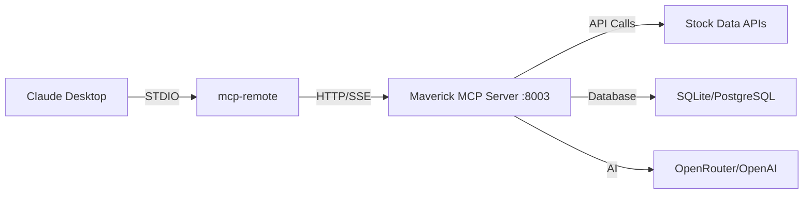

# Claude Desktop Setup

Complete guide for integrating Maverick MCP with Claude Desktop.

## Overview

Claude Desktop supports the Model Context Protocol (MCP), allowing you to extend Claude's capabilities with custom tools. This guide shows you how to connect Maverick MCP to Claude Desktop for stock analysis and conference call analysis.

## Prerequisites

Before you begin:

1. **Server Running**: Maverick MCP server must be running
   ```bash
   make dev  # Server runs on port 8003
   ```

2. **Node.js Installed**: Required for mcp-remote bridge
   ```bash
   node --version  # Should be v16+
   ```

3. **Claude Desktop Installed**: Download from [claude.ai](https://claude.ai/download)

## Connection Architecture



**Why mcp-remote?**

- Claude Desktop only supports STDIO transport
- Maverick MCP runs as HTTP/SSE server
- mcp-remote bridges STDIO ↔ HTTP/SSE

## Method A: SSE Transport (Recommended)

This is the **most stable** configuration, tested and proven to prevent tools from disappearing.

### Step 1: Locate Configuration File

Find your Claude Desktop config file:

=== "macOS"
    ```bash
    # Path
    ~/Library/Application Support/Claude/claude_desktop_config.json

    # Quick edit
    nano ~/Library/Application\ Support/Claude/claude_desktop_config.json
    ```

=== "Windows"
    ```cmd
    # Path
    %APPDATA%\Claude\claude_desktop_config.json

    # Quick edit
    notepad %APPDATA%\Claude\claude_desktop_config.json
    ```

=== "Linux"
    ```bash
    # Path
    ~/.config/Claude/claude_desktop_config.json

    # Quick edit
    nano ~/.config/Claude/claude_desktop_config.json
    ```

### Step 2: Add Maverick MCP Configuration

Create or edit the file with this configuration:

```json
{
  "mcpServers": {
    "maverick-mcp": {
      "command": "npx",
      "args": ["-y", "mcp-remote", "http://localhost:8003/sse/"]
    }
  }
}
```

!!! warning "Critical: Trailing Slash Required"
    The SSE endpoint **must** include the trailing slash: `/sse/`

    ✅ **Correct**: `http://localhost:8003/sse/`

    ❌ **Wrong**: `http://localhost:8003/sse`

    Without the trailing slash, you'll get 307 redirects that cause tools to disappear!

### Step 3: Restart Claude Desktop

1. **Quit Claude Desktop completely** (not just close window)
   - macOS: `Cmd+Q` or Claude menu → Quit
   - Windows: Right-click taskbar icon → Exit
   - Linux: Close all windows

2. **Wait 5 seconds**

3. **Reopen Claude Desktop**

### Step 4: Verify Connection

Test that the connection works:

```
User: "List available tools"
```

You should see **40+ tools** including:

- `concall_fetch_transcript`
- `concall_summarize_transcript`
- `concall_analyze_sentiment`
- `concall_query_transcript`
- `concall_compare_quarters`
- `data_fetch_stock_data`
- `technical_get_full_technical_analysis`
- `screening_get_maverick_stocks`
- And many more...

### Step 5: Test with Commands

Try these commands:

```
Get technical analysis for AAPL
```

```
Fetch the RELIANCE.NS Q1 2025 earnings call transcript
```

```
Show me the top Maverick bullish stocks
```

If tools appear and work correctly, you're all set! 🎉

## Method B: HTTP Streamable (Alternative)

If SSE doesn't work for some reason, try HTTP Streamable:

```json
{
  "mcpServers": {
    "maverick-mcp": {
      "command": "npx",
      "args": ["-y", "mcp-remote", "http://localhost:8003/mcp/"]
    }
  }
}
```

!!! note
    Also requires trailing slash: `/mcp/`

## Troubleshooting

### Tools Disappear After Initial Connection

**Symptom**: Tools show up briefly, then disappear.

**Cause**: Missing trailing slash causes 307 redirect.

**Solution**:
```json
{
  "mcpServers": {
    "maverick-mcp": {
      "command": "npx",
      "args": ["-y", "mcp-remote", "http://localhost:8003/sse/"]
    }
  }
}
```

Note the `/` at the end of `/sse/`!

### Connection Failed

**Check server is running**:
```bash
lsof -i :8003
```

Should show:
```
COMMAND   PID   USER   FD   TYPE             DEVICE SIZE/OFF NODE NAME
Python  12345  user    8u  IPv4 0x1234567890      0t0  TCP *:8003 (LISTEN)
```

If nothing shows:
```bash
make dev  # Start the server
```

### Invalid JSON Error

**Check config file syntax**:
```bash
# Validate JSON
cat ~/Library/Application\ Support/Claude/claude_desktop_config.json | python -m json.tool
```

Common mistakes:
- Missing commas between entries
- Extra comma after last entry
- Unclosed brackets or quotes

### npx Command Not Found

**Install Node.js**:

=== "macOS"
    ```bash
    brew install node
    ```

=== "Windows"
    Download from [nodejs.org](https://nodejs.org)

=== "Linux"
    ```bash
    sudo apt update
    sudo apt install nodejs npm
    ```

### Port Already in Use

**Find what's using port 8003**:
```bash
lsof -i :8003
kill -9 <PID>  # Kill the process
make dev       # Restart Maverick MCP
```

### mcp-remote Installation Issues

**Manual install**:
```bash
npm install -g mcp-remote
```

**Check version**:
```bash
npx mcp-remote --version
```

### Server Logs

**View real-time logs**:
```bash
make tail-log
```

**Check for errors**:
```bash
tail -100 ~/.maverick_mcp/logs/maverick.log
```

## Multiple Servers Configuration

If you have multiple MCP servers, add them all:

```json
{
  "mcpServers": {
    "maverick-mcp": {
      "command": "npx",
      "args": ["-y", "mcp-remote", "http://localhost:8003/sse/"]
    },
    "other-mcp-server": {
      "command": "node",
      "args": ["/path/to/other/server.js"]
    }
  }
}
```

## Auto-Start Server (Optional)

### macOS (LaunchAgent)

Create `~/Library/LaunchAgents/com.maverick-mcp.plist`:

```xml
<?xml version="1.0" encoding="UTF-8"?>
<!DOCTYPE plist PUBLIC "-//Apple//DTD PLIST 1.0//EN" "http://www.apple.com/DTDs/PropertyList-1.0.dtd">
<plist version="1.0">
<dict>
    <key>Label</key>
    <string>com.maverick-mcp</string>
    <key>ProgramArguments</key>
    <array>
        <string>/usr/local/bin/python3</string>
        <string>-m</string>
        <string>maverick_server</string>
        <string>--transport</string>
        <string>sse</string>
        <string>--port</string>
        <string>8003</string>
    </array>
    <key>WorkingDirectory</key>
    <string>/Users/YOUR_USERNAME/maverick-mcp</string>
    <key>StandardOutPath</key>
    <string>/tmp/maverick-mcp.out.log</string>
    <key>StandardErrorPath</key>
    <string>/tmp/maverick-mcp.err.log</string>
    <key>KeepAlive</key>
    <true/>
</dict>
</plist>
```

Load it:
```bash
launchctl load ~/Library/LaunchAgents/com.maverick-mcp.plist
```

### Linux (systemd)

Create `/etc/systemd/system/maverick-mcp.service`:

```ini
[Unit]
Description=Maverick MCP Server
After=network.target

[Service]
Type=simple
User=YOUR_USERNAME
WorkingDirectory=/home/YOUR_USERNAME/maverick-mcp
ExecStart=/usr/bin/python3 -m maverick_server --transport sse --port 8003
Restart=always
RestartSec=10

[Install]
WantedBy=multi-user.target
```

Enable and start:
```bash
sudo systemctl daemon-reload
sudo systemctl enable maverick-mcp
sudo systemctl start maverick-mcp
```

### Windows (Task Scheduler)

1. Open Task Scheduler
2. Create Basic Task
3. Name: "Maverick MCP Server"
4. Trigger: At log on
5. Action: Start a program
6. Program: `python.exe`
7. Arguments: `-m maverick_server --transport sse --port 8003`
8. Start in: `C:\path\to\maverick-mcp`

## Security Considerations

### Local Network Only

By default, the server binds to `localhost` (127.0.0.1), making it accessible only from your machine.

To allow network access (use with caution):
```bash
python -m maverick_server --host 0.0.0.0 --port 8003
```

### Firewall Configuration

If using network access, configure firewall:

=== "macOS"
    ```bash
    # Allow incoming on port 8003
    sudo /usr/libexec/ApplicationFirewall/socketfilterfw --add /path/to/python
    sudo /usr/libexec/ApplicationFirewall/socketfilterfw --unblockapp /path/to/python
    ```

=== "Linux (ufw)"
    ```bash
    sudo ufw allow 8003/tcp
    ```

=== "Windows"
    Windows Firewall → Advanced Settings → Inbound Rules → New Rule → Port 8003

### API Keys

Ensure your `.env` file is secure:
```bash
chmod 600 .env  # Unix/Linux/macOS
```

Never commit `.env` to version control!

## Performance Tips

### Use Redis Caching

For better performance:
```bash
brew install redis
brew services start redis
```

Add to `.env`:
```ini
REDIS_HOST=localhost
REDIS_PORT=6379
```

### PostgreSQL Database

For larger datasets:
```bash
# Install PostgreSQL
brew install postgresql

# Create database
createdb maverick_mcp

# Update .env
DATABASE_URL=postgresql://localhost/maverick_mcp
```

### Increase Worker Threads

For heavy usage:
```bash
python -m maverick_server --workers 4
```

## Next Steps

Now that Claude Desktop is connected:

- 📖 [Learn about Features](../features/overview.md)
- 📞 [Explore Conference Call Analysis](../concall/overview.md)
- 💡 [See Examples](../user-guide/examples.md)
- 🔧 [Browse All Tools](../user-guide/mcp-tools-reference.md)

## Need Help?

- 🐛 [Report Issues](https://github.com/arunbcodes/maverick-mcp/issues)
- 📚 [Troubleshooting Guide](../user-guide/troubleshooting.md)
- ❓ [FAQ](../about/faq.md)
