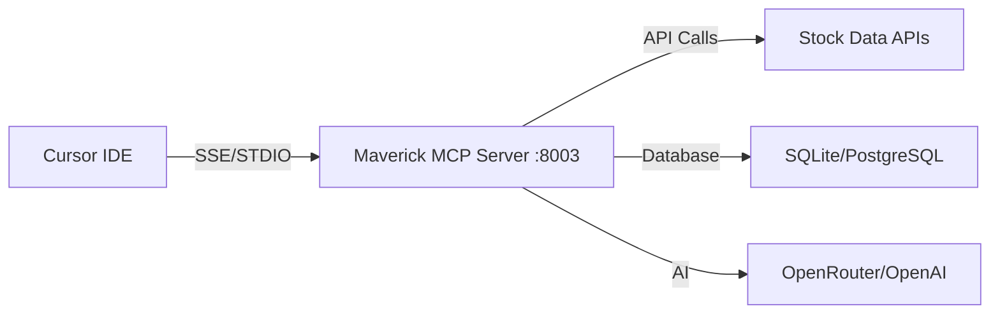

# Cursor IDE Setup

Complete guide for integrating Maverick MCP with Cursor IDE.

## Overview

Cursor IDE has native MCP support, making integration straightforward. This guide shows you how to connect Maverick MCP to Cursor for stock analysis directly in your development environment.

## Prerequisites

1. **Cursor IDE Installed**: Download from [cursor.sh](https://cursor.sh)
2. **Server Running**:
   ```bash
   make dev  # Server runs on port 8003
   ```

## Connection Architecture



**Cursor Advantages:**

- Native STDIO support (via mcp-remote bridge)
- Better integration with IDE workflow
- Direct access to all MCP tools

!!! note "Why mcp-remote?"
Cursor doesn't support direct SSE connections reliably. The `mcp-remote` package bridges STDIO (which Cursor supports) to SSE (which the server uses).

## Method A: STDIO via mcp-remote (Recommended)

Direct SSE connections don't work reliably with Cursor. Use `mcp-remote` as a bridge instead.

### Step 1: Ensure Node.js 18+ is Installed

**Check your Node version:**

```bash
node --version
```

If you have Node < 18, install Node 20:

```bash
# Using nvm (recommended)
nvm install 20
nvm use 20
nvm alias default 20
```

### Step 2: Configure MCP Server

**Recommended Configuration (Full Path - Most Reliable):**

Create or edit `~/.cursor/mcp.json`:

```json
{
  "mcpServers": {
    "maverick-mcp": {
      "command": "/Users/YOUR_USERNAME/.nvm/versions/node/v20.19.5/bin/npx",
      "args": ["-y", "mcp-remote", "http://127.0.0.1:8003/sse"],
      "env": {
        "PATH": "/Users/YOUR_USERNAME/.nvm/versions/node/v20.19.5/bin:/usr/local/bin:/usr/bin:/bin"
      }
    }
  }
}
```

**To find your Node v20 path:**

```bash
nvm use 20
which npx
# Example output: /Users/YOUR_USERNAME/.nvm/versions/node/v20.19.5/bin/npx
```

Replace `YOUR_USERNAME` with your actual username.

**Simple Configuration (If Node 20 is in PATH):**

```json
{
  "mcpServers": {
    "maverick-mcp": {
      "command": "npx",
      "args": ["-y", "mcp-remote", "http://127.0.0.1:8003/sse"]
    }
  }
}
```

!!! warning "Important Configuration Notes" - **Node.js 18+** required (mcp-remote doesn't work with Node 14) - Use **`127.0.0.1`** not `localhost` (Docker IPv4 vs IPv6 issue) - **No trailing slash** on `/sse` (prevents 307 redirect) - Full path to npx ensures Cursor uses the correct Node version

### Step 3: Restart Cursor

1. Close Cursor completely
2. Reopen Cursor
3. The MCP server should connect automatically

### Step 4: Verify Connection

Open Cursor's AI chat and test:

```
List available MCP tools
```

You should see 40+ tools including:

- concall_fetch_transcript
- concall_summarize_transcript
- data_fetch_stock_data
- technical_get_full_technical_analysis
- And more...

### Step 5: Test with Commands

Try these in Cursor's AI chat:

```
Get technical analysis for AAPL and explain the RSI indicator
```

```
Fetch RELIANCE.NS Q1 2025 earnings call and summarize key points
```

```
Show me code to calculate moving averages using the MCP tools
```

## Alternative: Direct STDIO (Development Only)

For local development without Docker, you can run the server directly:

```json
{
  "mcpServers": {
    "maverick-mcp": {
      "command": "uv",
      "args": [
        "run",
        "python",
        "-m",
        "maverick_server",
        "--transport",
        "stdio"
      ],
      "cwd": "/path/to/maverick-mcp"
    }
  }
}
```

Replace `/path/to/maverick-mcp` with your actual path.

!!! warning "Direct STDIO Limitations"
This method bypasses Docker and runs the Python server directly. Only use this if you're actively developing the MCP server itself.

## Configuration File Location

Cursor stores MCP configuration in:

=== "macOS"
`    ~/.cursor/mcp.json
   `

=== "Windows"
`    %USERPROFILE%\.cursor\mcp.json
   `

=== "Linux"
`    ~/.cursor/mcp.json
   `

## Advanced Configuration

### Multiple Servers

Configure multiple MCP servers:

```json
{
  "mcpServers": {
    "maverick-mcp": {
      "url": "http://localhost:8003/sse/"
    },
    "other-mcp-server": {
      "url": "http://localhost:8004/sse/"
    }
  }
}
```

### Custom Port

If using a different port:

```json
{
  "mcpServers": {
    "maverick-mcp": {
      "url": "http://localhost:9000/sse/"
    }
  }
}
```

Start server on custom port:

```bash
python -m maverick_server --port 9000
```

### Environment Variables

Pass environment variables to STDIO mode:

```json
{
  "mcpServers": {
    "maverick-mcp": {
      "command": "python",
      "args": ["-m", "maverick_server", "--transport", "stdio"],
      "cwd": "/path/to/maverick-mcp",
      "env": {
        "TIINGO_API_KEY": "your-key",
        "OPENROUTER_API_KEY": "your-key"
      }
    }
  }
}
```

!!! warning "Security"
Avoid storing API keys in config files. Use `.env` file instead.

## Usage in Cursor

### AI Chat

Access MCP tools through Cursor's AI chat:

```
@maverick-mcp Get stock data for AAPL
```

```
@maverick-mcp Analyze sentiment for TCS Q1 2025
```

### Code Generation

Use MCP tools to generate code:

```
Generate Python code to fetch and plot AAPL stock data
using the Maverick MCP tools
```

```
Write a function that uses MCP to analyze multiple stocks
and returns a comparison table
```

### Context-Aware Analysis

Cursor can use MCP tools with your code:

```
Analyze the stock symbols in this file using technical analysis
```

```
Fetch earnings call transcripts for all companies mentioned in this code
```

## Troubleshooting

### "Loading tools..." Forever

**Symptom:** Status shows "loading tools" indefinitely or never completes.

**Cause:** Node.js version incompatibility. `mcp-remote` requires Node 18+, but Cursor may use system Node 14.

**Solution:**

1. **Verify your Node version:**

   ```bash
   node --version
   ```

2. **If Node < 18, install Node 20:**

   ```bash
   nvm install 20
   nvm use 20
   ```

3. **Use full path in config:**

   ```json
   {
     "mcpServers": {
       "maverick-mcp": {
         "command": "/Users/YOUR_USERNAME/.nvm/versions/node/v20.19.5/bin/npx",
         "args": ["-y", "mcp-remote", "http://127.0.0.1:8003/sse"],
         "env": {
           "PATH": "/Users/YOUR_USERNAME/.nvm/versions/node/v20.19.5/bin:/usr/local/bin:/usr/bin:/bin"
         }
       }
     }
   }
   ```

4. **Completely restart Cursor** (Cmd+Q, not just close window)

### Syntax Error: node:fs/promises

**Full Error:**

```
SyntaxError: The requested module 'node:fs/promises' does not provide an export named 'constants'
```

**Cause:** This error confirms Node version is too old.

**Solution:** Follow the steps above to use Node 20.

### Connection Refused on ::1 (IPv6)

**Symptom:** `connect ECONNREFUSED ::1:8003`

**Cause:** `mcp-remote` tries IPv6 first, but Docker only listens on IPv4.

**Solution:** Use `127.0.0.1` instead of `localhost`:

```json
{
  "args": ["-y", "mcp-remote", "http://127.0.0.1:8003/sse"]
}
```

### Connection Failed

**Check server status**:

```bash
lsof -i :8003
# Or with Docker
docker ps | grep maverick
```

**View logs**:

```bash
make tail-log
# Or with Docker
docker logs maverick-mcp-backend-1 --tail 50
```

**Restart server**:

```bash
make stop
make dev
# Or with Docker
docker-compose restart
```

### Tools Not Appearing

1. **Verify config syntax**:

   - Open `~/.cursor/mcp.json`
   - Ensure valid JSON (no trailing commas)
   - Check quotes are correct

2. **Verify Node path**:

   ```bash
   which npx
   # Should match the path in your config
   ```

3. **Check server is running**:

   ```bash
   curl http://127.0.0.1:8003/sse
   # Should return SSE connection or see streaming
   ```

4. **Restart Cursor completely**:
   - Quit (Cmd+Q on Mac)
   - Wait 5 seconds
   - Reopen

### npm Cache Permission Errors

**Symptom:** `EPERM: operation not permitted` errors

**Solution:**

```bash
sudo chown -R $(whoami) ~/.npm
```

### STDIO Mode Issues

**Permission errors**:

```bash
chmod +x /path/to/maverick-mcp/packages/server/src/maverick_server/__main__.py
```

**Python not found**:

```json
{
  "command": "/full/path/to/python3",
  "args": ["-m", "maverick_server", "--transport", "stdio"]
}
```

Find Python path:

```bash
which python3
```

### Port Conflicts

**Change port**:

```json
{
  "url": "http://localhost:8004/sse/"
}
```

Start on new port:

```bash
python -m maverick_server --port 8004
```

## Integration Patterns

### Stock Analysis Workflow

1. **Analyze in Chat**:

   ```
   Get full technical analysis for AAPL
   ```

2. **Generate Code**:

   ```
   Write code to automate this analysis for multiple stocks
   ```

3. **Iterate**:
   ```
   Add error handling and export to CSV
   ```

### Conference Call Analysis

1. **Fetch Transcript**:

   ```
   Fetch RELIANCE.NS Q1 2025 earnings call
   ```

2. **Analyze**:

   ```
   Summarize and analyze sentiment
   ```

3. **Generate Report**:
   ```
   Create a markdown report with the analysis
   ```

### Multi-Stock Comparison

1. **Fetch Data**:

   ```
   Get stock data for AAPL, MSFT, GOOGL
   ```

2. **Compare**:

   ```
   Calculate correlation matrix
   ```

3. **Visualize**:
   ```
   Generate plotly chart comparing performance
   ```

## Keyboard Shortcuts

### Open AI Chat

- **macOS**: `Cmd + K`
- **Windows/Linux**: `Ctrl + K`

### MCP Tool Selection

- Type `@maverick-mcp` in chat
- Press Space to see tool list
- Arrow keys to navigate
- Enter to select

## Best Practices

### 1. Use Descriptive Commands

❌ **Bad**:

```
Get data
```

✅ **Good**:

```
Get historical stock data for AAPL from Jan 2024 to Dec 2024
```

### 2. Combine Tools

```
Fetch RELIANCE.NS Q1 2025 transcript, summarize it,
analyze sentiment, and tell me the top 3 concerns
```

### 3. Generate Reusable Code

```
Create a Python class that wraps the Maverick MCP tools
for easier stock analysis
```

### 4. Use with Existing Code

```
Analyze the stocks in stocks.csv using technical indicators
from Maverick MCP
```

## Performance Tips

### Enable Caching

Add to `.env`:

```ini
REDIS_HOST=localhost
REDIS_PORT=6379
```

Start Redis:

```bash
brew install redis
brew services start redis
```

### Use PostgreSQL

For larger datasets:

```ini
DATABASE_URL=postgresql://localhost/maverick_mcp
```

### Parallel Requests

MCP server handles concurrent requests automatically.

## Security

### Local Development Only

By default, server binds to localhost only.

### API Keys in .env

Never hardcode API keys:

```ini
# .env file
TIINGO_API_KEY=your-key
OPENROUTER_API_KEY=your-key
OPENAI_API_KEY=your-key
```

### Gitignore

Ensure `.env` is in `.gitignore`:

```
.env
.env.*
```

## Cursor-Specific Features

### Code Actions

Cursor can suggest MCP tools automatically:

1. Select stock symbol in code
2. Right-click → "Analyze with MCP"
3. Cursor suggests relevant tools

### Inline Suggestions

Type stock symbols and Cursor may suggest:

```python
# AAPL
# Cursor suggests: Fetch AAPL data with MCP?
```

### Composer Mode

Use MCP tools in Composer for complex tasks:

```
Create a stock analysis dashboard that:
1. Fetches data for multiple stocks
2. Calculates technical indicators
3. Generates comparison charts
4. Exports to HTML report
```

## Comparison: Cursor vs Claude Desktop

| Feature            | Cursor IDE                     | Claude Desktop            |
| ------------------ | ------------------------------ | ------------------------- |
| Native MCP Support | ✅ STDIO (via mcp-remote)      | ✅ STDIO (via mcp-remote) |
| Code Integration   | ✅ Direct                      | ❌ Manual copy            |
| Context Awareness  | ✅ Full IDE context            | ❌ Chat only              |
| Setup Complexity   | ⭐⭐ Medium (Node 20 required) | ⭐⭐ Medium               |
| Best For           | Development                    | General analysis          |

!!! note "Both Need mcp-remote"
Both Cursor and Claude Desktop require the `mcp-remote` bridge when connecting to SSE servers. The key difference is Cursor's IDE integration.

## Next Steps

Now that Cursor is connected:

- 📖 [Learn about Features](../features/overview.md)
- 📞 [Explore Conference Call Analysis](../concall/overview.md)
- 💡 [See Examples](../user-guide/examples.md)
- 🔧 [Browse All Tools](../user-guide/mcp-tools-reference.md)

## Need Help?

- 🐛 [Report Issues](https://github.com/arunbcodes/maverick-mcp/issues)
- 📚 [Troubleshooting Guide](../user-guide/troubleshooting.md)
- ❓ [FAQ](../about/faq.md)
- 💬 [Cursor Community](https://forum.cursor.sh)
