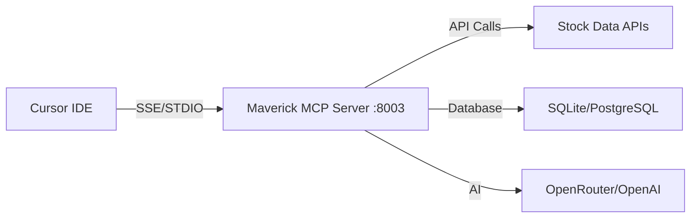

# Cursor IDE Setup

Complete guide for integrating Maverick MCP with Cursor IDE.

## Overview

Cursor IDE has native MCP support, making integration straightforward. This guide shows you how to connect Maverick MCP to Cursor for stock analysis directly in your development environment.

## Prerequisites

1. **Cursor IDE Installed**: Download from [cursor.sh](https://cursor.sh)
2. **Server Running**:
   ```bash
   make dev  # Server runs on port 8003
   ```

## Connection Architecture



**Cursor Advantages:**

- Native SSE and STDIO support
- No mcp-remote bridge needed
- Direct connection to MCP servers
- Better integration with IDE workflow

## Method A: Direct SSE Connection (Recommended)

### Step 1: Open Cursor Settings

1. Open Cursor IDE
2. Click Settings (gear icon) or `Cmd/Ctrl + ,`
3. Search for "MCP" or navigate to Extensions → MCP Servers

### Step 2: Configure MCP Server

Add Maverick MCP configuration:

```json
{
  "mcpServers": {
    "maverick-mcp": {
      "url": "http://localhost:8003/sse/"
    }
  }
}
```

!!! warning "Trailing Slash Required"
    Always include the trailing slash: `/sse/`

### Step 3: Restart Cursor

1. Close Cursor completely
2. Reopen Cursor
3. The MCP server should connect automatically

### Step 4: Verify Connection

Open Cursor's AI chat and test:

```
List available MCP tools
```

You should see 40+ tools including:

- concall_fetch_transcript
- concall_summarize_transcript
- data_fetch_stock_data
- technical_get_full_technical_analysis
- And more...

### Step 5: Test with Commands

Try these in Cursor's AI chat:

```
Get technical analysis for AAPL and explain the RSI indicator
```

```
Fetch RELIANCE.NS Q1 2025 earnings call and summarize key points
```

```
Show me code to calculate moving averages using the MCP tools
```

## Method B: STDIO Connection (Alternative)

If SSE doesn't work, use STDIO:

```json
{
  "mcpServers": {
    "maverick-mcp": {
      "command": "python",
      "args": [
        "-m",
        "maverick_mcp.api.server",
        "--transport",
        "stdio"
      ],
      "cwd": "/path/to/maverick-mcp"
    }
  }
}
```

Replace `/path/to/maverick-mcp` with your actual path.

## Configuration File Locations

Cursor stores MCP configuration in:

=== "macOS"
    ```
    ~/Library/Application Support/Cursor/User/settings.json
    ```

=== "Windows"
    ```
    %APPDATA%\Cursor\User\settings.json
    ```

=== "Linux"
    ```
    ~/.config/Cursor/User/settings.json
    ```

## Advanced Configuration

### Multiple Servers

Configure multiple MCP servers:

```json
{
  "mcpServers": {
    "maverick-mcp": {
      "url": "http://localhost:8003/sse/"
    },
    "other-mcp-server": {
      "url": "http://localhost:8004/sse/"
    }
  }
}
```

### Custom Port

If using a different port:

```json
{
  "mcpServers": {
    "maverick-mcp": {
      "url": "http://localhost:9000/sse/"
    }
  }
}
```

Start server on custom port:
```bash
python -m maverick_mcp.api.server --port 9000
```

### Environment Variables

Pass environment variables to STDIO mode:

```json
{
  "mcpServers": {
    "maverick-mcp": {
      "command": "python",
      "args": ["-m", "maverick_mcp.api.server", "--transport", "stdio"],
      "cwd": "/path/to/maverick-mcp",
      "env": {
        "TIINGO_API_KEY": "your-key",
        "OPENROUTER_API_KEY": "your-key"
      }
    }
  }
}
```

!!! warning "Security"
    Avoid storing API keys in config files. Use `.env` file instead.

## Usage in Cursor

### AI Chat

Access MCP tools through Cursor's AI chat:

```
@maverick-mcp Get stock data for AAPL
```

```
@maverick-mcp Analyze sentiment for TCS Q1 2025
```

### Code Generation

Use MCP tools to generate code:

```
Generate Python code to fetch and plot AAPL stock data
using the Maverick MCP tools
```

```
Write a function that uses MCP to analyze multiple stocks
and returns a comparison table
```

### Context-Aware Analysis

Cursor can use MCP tools with your code:

```
Analyze the stock symbols in this file using technical analysis
```

```
Fetch earnings call transcripts for all companies mentioned in this code
```

## Troubleshooting

### Connection Failed

**Check server status**:
```bash
lsof -i :8003
```

**View logs**:
```bash
make tail-log
```

**Restart server**:
```bash
make stop
make dev
```

### Tools Not Appearing

1. **Verify config syntax**:
   - Open Cursor settings
   - Check MCP Servers section
   - Ensure valid JSON

2. **Check trailing slash**:
   - SSE endpoint must be `http://localhost:8003/sse/`
   - Not `http://localhost:8003/sse`

3. **Restart Cursor completely**:
   - Close all windows
   - Wait 5 seconds
   - Reopen

### STDIO Mode Issues

**Permission errors**:
```bash
chmod +x /path/to/maverick-mcp/maverick_mcp/api/server.py
```

**Python not found**:
```json
{
  "command": "/full/path/to/python3",
  "args": ["-m", "maverick_mcp.api.server", "--transport", "stdio"]
}
```

Find Python path:
```bash
which python3
```

### Port Conflicts

**Change port**:
```json
{
  "url": "http://localhost:8004/sse/"
}
```

Start on new port:
```bash
python -m maverick_mcp.api.server --port 8004
```

## Integration Patterns

### Stock Analysis Workflow

1. **Analyze in Chat**:
   ```
   Get full technical analysis for AAPL
   ```

2. **Generate Code**:
   ```
   Write code to automate this analysis for multiple stocks
   ```

3. **Iterate**:
   ```
   Add error handling and export to CSV
   ```

### Conference Call Analysis

1. **Fetch Transcript**:
   ```
   Fetch RELIANCE.NS Q1 2025 earnings call
   ```

2. **Analyze**:
   ```
   Summarize and analyze sentiment
   ```

3. **Generate Report**:
   ```
   Create a markdown report with the analysis
   ```

### Multi-Stock Comparison

1. **Fetch Data**:
   ```
   Get stock data for AAPL, MSFT, GOOGL
   ```

2. **Compare**:
   ```
   Calculate correlation matrix
   ```

3. **Visualize**:
   ```
   Generate plotly chart comparing performance
   ```

## Keyboard Shortcuts

### Open AI Chat
- **macOS**: `Cmd + K`
- **Windows/Linux**: `Ctrl + K`

### MCP Tool Selection
- Type `@maverick-mcp` in chat
- Press Space to see tool list
- Arrow keys to navigate
- Enter to select

## Best Practices

### 1. Use Descriptive Commands

❌ **Bad**:
```
Get data
```

✅ **Good**:
```
Get historical stock data for AAPL from Jan 2024 to Dec 2024
```

### 2. Combine Tools

```
Fetch RELIANCE.NS Q1 2025 transcript, summarize it,
analyze sentiment, and tell me the top 3 concerns
```

### 3. Generate Reusable Code

```
Create a Python class that wraps the Maverick MCP tools
for easier stock analysis
```

### 4. Use with Existing Code

```
Analyze the stocks in stocks.csv using technical indicators
from Maverick MCP
```

## Performance Tips

### Enable Caching

Add to `.env`:
```ini
REDIS_HOST=localhost
REDIS_PORT=6379
```

Start Redis:
```bash
brew install redis
brew services start redis
```

### Use PostgreSQL

For larger datasets:
```ini
DATABASE_URL=postgresql://localhost/maverick_mcp
```

### Parallel Requests

MCP server handles concurrent requests automatically.

## Security

### Local Development Only

By default, server binds to localhost only.

### API Keys in .env

Never hardcode API keys:

```ini
# .env file
TIINGO_API_KEY=your-key
OPENROUTER_API_KEY=your-key
OPENAI_API_KEY=your-key
```

### Gitignore

Ensure `.env` is in `.gitignore`:
```
.env
.env.*
```

## Cursor-Specific Features

### Code Actions

Cursor can suggest MCP tools automatically:

1. Select stock symbol in code
2. Right-click → "Analyze with MCP"
3. Cursor suggests relevant tools

### Inline Suggestions

Type stock symbols and Cursor may suggest:
```python
# AAPL
# Cursor suggests: Fetch AAPL data with MCP?
```

### Composer Mode

Use MCP tools in Composer for complex tasks:

```
Create a stock analysis dashboard that:
1. Fetches data for multiple stocks
2. Calculates technical indicators
3. Generates comparison charts
4. Exports to HTML report
```

## Comparison: Cursor vs Claude Desktop

| Feature | Cursor IDE | Claude Desktop |
|---------|-----------|----------------|
| Native MCP Support | ✅ SSE + STDIO | ⚠️ STDIO only (needs mcp-remote) |
| Code Integration | ✅ Direct | ❌ Manual copy |
| Context Awareness | ✅ Full IDE context | ❌ Chat only |
| Setup Complexity | ⭐⭐ Easy | ⭐⭐⭐ Medium |
| Best For | Development | General analysis |

## Next Steps

Now that Cursor is connected:

- 📖 [Learn about Features](../features/overview.md)
- 📞 [Explore Conference Call Analysis](../concall/overview.md)
- 💡 [See Examples](../user-guide/examples.md)
- 🔧 [Browse All Tools](../user-guide/mcp-tools-reference.md)

## Need Help?

- 🐛 [Report Issues](https://github.com/arunbcodes/maverick-mcp/issues)
- 📚 [Troubleshooting Guide](../user-guide/troubleshooting.md)
- ❓ [FAQ](../about/faq.md)
- 💬 [Cursor Community](https://forum.cursor.sh)
