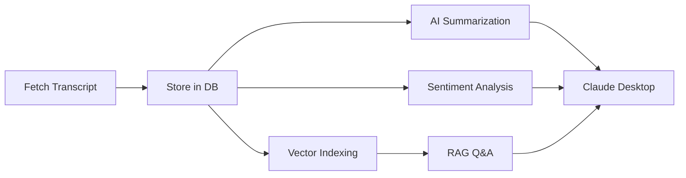

# Maverick MCP

<div align="center">

**Personal Stock Analysis MCP Server with AI-Powered Conference Call Analysis**

[](https://github.com/arunbcodes/maverick-mcp)
[](https://opensource.org/licenses/MIT)
[](https://www.python.org/downloads/)
[](https://modelcontextprotocol.io)

[Get Started](getting-started/quick-start.md){ .md-button .md-button--primary }
[View on GitHub](https://github.com/arunbcodes/maverick-mcp){ .md-button }

</div>

## Overview

Maverick MCP is a comprehensive Model Context Protocol (MCP) server that brings powerful stock analysis capabilities to Claude Desktop and other MCP clients. It combines real-time market data, technical analysis, AI-powered research, and conference call analysis into a single, easy-to-use platform.

## ✨ Key Features

### 📊 Stock Analysis
- **Multi-Market Support**: US (NASDAQ/NYSE), Indian NSE (.NS), and Indian BSE (.BO)
- **Real-time & Historical Data**: Complete OHLCV data with intelligent caching
- **Technical Analysis**: RSI, MACD, Bollinger Bands, Moving Averages, and more
- **Pre-seeded Database**: 520+ S&P 500 stocks ready to analyze

### 📞 Conference Call Analysis
- **Transcript Fetching**: Multi-source fetching from IR websites and NSE filings
- **AI Summarization**: Structured summaries with key metrics and insights
- **Sentiment Analysis**: Multi-dimensional sentiment with confidence scoring
- **RAG Q&A**: Ask questions about earnings calls with source citations
- **Trend Analysis**: Compare sentiment across multiple quarters

### 🔍 Stock Screening
- **Maverick Bullish**: High momentum stocks with strong technicals
- **Maverick Bearish**: Weak setups for short opportunities
- **Supply/Demand Breakouts**: Confirmed uptrend patterns
- **7 Indian Market Strategies**: Specialized screens for NSE/BSE

### 📈 Advanced Features
- **Portfolio Optimization**: Modern Portfolio Theory with risk analysis
- **Research Agents**: AI-powered market research with 7-256x speedup
- **Backtesting Framework**: VectorBT-powered strategy testing with 15+ algorithms
- **Economic Indicators**: RBI data, inflation, GDP, forex reserves

## 🚀 Quick Example

Once connected to Claude Desktop:

```
User: "Fetch and summarize the RELIANCE.NS Q1 2025 earnings call"
Claude: [Uses MCP tools to fetch transcript and generate AI summary]

User: "What did management say about growth guidance?"
Claude: [Queries transcript using RAG for specific information]

User: "Compare sentiment across the last 3 quarters"
Claude: [Analyzes sentiment trends with scoring]
```

## 🎯 Perfect For

- **Personal Stock Research**: Deep analysis of companies and markets
- **Earnings Call Analysis**: AI-powered insights from conference calls
- **Technical Trading**: Comprehensive technical analysis tools
- **Portfolio Management**: Risk-adjusted portfolio optimization
- **Market Research**: AI agents with web search capabilities

## 🏗️ Architecture

Maverick MCP is built with a focus on:

- **Modularity**: Clean separation of concerns with SOLID principles
- **Performance**: Intelligent caching with Redis/SQLite support
- **Extensibility**: Easy to add new features and data sources
- **Reliability**: Comprehensive error handling and fallback mechanisms

## 🌟 What Makes It Special

### Personal Use Focus
No authentication, no billing, no complexity. Just powerful analysis tools for your personal use.

### AI Integration
- OpenRouter integration for access to 400+ AI models
- Smart model selection for cost optimization (40-60% savings)
- Parallel agent orchestration for research tasks

### Conference Call System
Complete pipeline for earnings call analysis:



### Multi-Market Support
Seamless analysis across:
- 🇺🇸 US Markets (NASDAQ/NYSE)
- 🇮🇳 Indian NSE (.NS suffix)
- 🇮🇳 Indian BSE (.BO suffix)

## 📦 What's Included

- **35+ MCP Tools**: Complete toolkit for stock analysis
- **5 Conference Call Tools**: Fetch, summarize, analyze, query, compare
- **Pre-seeded Data**: 520 S&P 500 stocks + screening recommendations
- **Indian Market Data**: Nifty 50, Sensex constituents, economic indicators
- **Comprehensive Tests**: 93 tests with 84% coverage
- **Production Ready**: Type-checked, linted, and tested

## 🔗 Integration

Works with all MCP-compatible clients:
- ✅ Claude Desktop (Recommended with SSE transport)
- ✅ Cursor IDE
- ✅ Claude Code CLI
- ✅ Continue.dev
- ✅ Windsurf IDE

## 📚 Next Steps

Ready to get started? Check out our comprehensive guides:

<div class="grid cards" markdown>

-   :material-rocket-launch:{ .lg .middle } **Quick Start**

    ---

    Get up and running in minutes

    [:octicons-arrow-right-24: Get Started](getting-started/quick-start.md)

-   :material-cog:{ .lg .middle } **Configuration**

    ---

    Configure API keys and settings

    [:octicons-arrow-right-24: Configure](getting-started/configuration.md)

-   :material-phone:{ .lg .middle } **Conference Calls**

    ---

    Learn about earnings call analysis

    [:octicons-arrow-right-24: Learn More](concall/overview.md)

-   :material-book:{ .lg .middle } **API Reference**

    ---

    Complete API documentation

    [:octicons-arrow-right-24: Browse API](api-reference/concall/models.md)

</div>

## 🤝 Contributing

Contributions are welcome! Check out our [Contributing Guide](development/contributing.md) to get started.

## 📄 License

This project is licensed under the MIT License - see the [LICENSE](about/license.md) page for details.

---

<div align="center">

Made with ❤️ for personal stock analysis

[Star on GitHub](https://github.com/arunbcodes/maverick-mcp){ .md-button }

</div>
